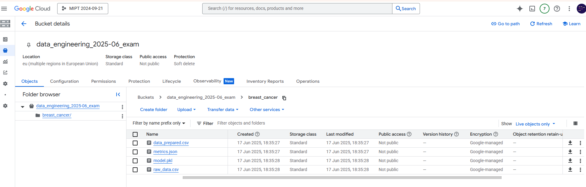
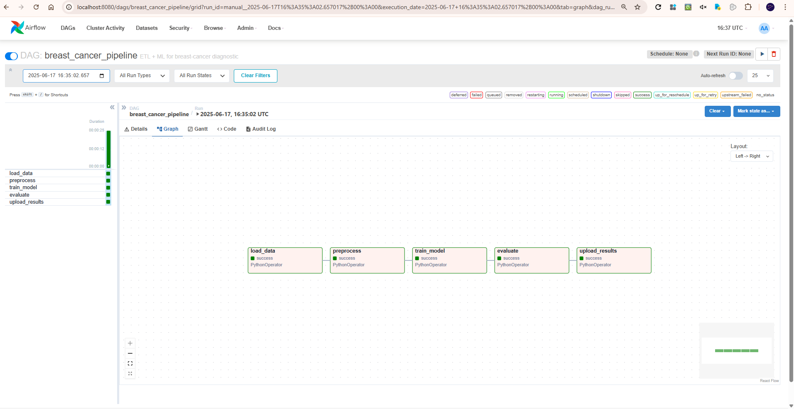

# Airflow + Logistic Regression Pipeline

> **Про что этот репозиторий**
> Шаблон репликабельного ML-пайплайна c ETL -> обучением -> развёртыванием артефактов, оркестрированного Apache Airflow.
> В демо-режиме качаем небольшой CSV, обучаем `LogisticRegression`, считаем метрики и складываем результаты в GCS **и/или** в `results/`.
> Хотите свой датасет / модель — меняете пару переменных, и шаблон превращается в ваш рабочий проект.

---

## 🗂️ Содержание

- [Airflow + Logistic Regression Pipeline](#airflow--logistic-regression-pipeline)
  - [🗂️ Содержание](#️-содержание)
  - [🎯 Цели и декомпозиция](#-цели-и-декомпозиция)
  - [🏗️ Архитектура и схема пайплайна](#️-архитектура-и-схема-пайплайна)
  - [📂 Структура репозитория](#-структура-репозитория)
  - [⚙️ Конфигурация](#️-конфигурация)
  - [🚀 Запуск](#-запуск)
    - [Локально (`make`)](#локально-make)
    - [Docker + Airflow](#docker--airflow)
  - [🛠️ Обоснование архитектурных решений](#️-обоснование-архитектурных-решений)
  - [⚠️ Потенциальные проблемы](#️-потенциальные-проблемы)
  - [💡 Идеи для развития](#-идеи-для-развития)
  - [Proofs](#proofs)

---

## 🎯 Цели и декомпозиция

* **ML-задача** — двоичная классификация: предсказать принадлежность объекта к классу `1`/`0` по набору признаков.
  В примере — медицинский датасет, но пайплайн независим от предметной области.

* **Цели проекта**

  1. **ETL** : воспроизводимо загрузить сырой CSV, очистить/масштабировать данные.
  2. **ML-Ops** : обучить модель, посчитать метрики, зафиксировать артефакты.
  3. **Интеграция** : выгрузить результаты во внешний Storage (GCS) + сохранить локально; обеспечить переиспользуемость кода, контейнеров и DAG.

* **Декомпозиция этапов**

| Этап           | Скрипт (модуль)         | Назначение                                                              |
| -------------- | ----------------------- | ----------------------------------------------------------------------- |
| **Load**       | `etl/load_data.py`      | Скачать исходный CSV и сложить в `results/raw_data.csv`.                |
| **Preprocess** | `etl/preprocess.py`     | Переименовать колонки, отфильтровать, стандартизовать признаки.         |
| **Train**      | `etl/train_model.py`    | Обучить `LogisticRegression`, сохранить `model.pkl`.                    |
| **Evaluate**   | `etl/evaluate.py`       | Посчитать Accuracy / Precision / Recall / F1, сохранить `metrics.json`. |
| **Upload**     | `etl/upload_results.py` | Отправить все файлы из `results/` в GCS (если задан бакет).             |

---

## 🏗️ Архитектура и схема пайплайна

```text
┌──────────────────┐
│  load_data       │  (PythonOperator)
└────────┬─────────┘
         │ raw_data.csv
┌────────▼─────────┐
│  preprocess      │
└────────┬─────────┘
         │ data_prepared.csv
┌────────▼─────────┐
│  train_model     │
└────────┬─────────┘
         │ model.pkl
┌────────▼─────────┐
│  evaluate        │
└────────┬─────────┘
         │ metrics.json
┌────────▼─────────┐
│  upload_results  │
└──────────────────┘
```

* **DAG-id**: `breast_cancer_pipeline`
* **Планировщик**: `schedule_interval` читается из переменной окружения `PIPELINE_SCHEDULE`
  (`None` -> только ручные запуски; пример CRON — `0 3 * * *`)

---

## 📂 Структура репозитория

```
├── dags/                # DAG Airflow «breast_cancer_pipeline»
├── etl/                 # независимые модули: load -> preprocess -> train -> evaluate -> upload
├── results/             # артефакты (csv / pkl / json) кладутся сюда
├── logs/                # runtime-логи (pipeline.log)
├── proofs/              # скриншоты UI / GCS (для отчёта)
├── keys/                # GCP service-account json
├── docker-compose.yml   # webserver + scheduler
├── Dockerfile           # образ со всеми зависимостями
├── requirements.txt
├── makefile             # локальный запуск без Docker/Airflow
├── .env                 # все переменные окружения
└── README.md            # текущий файл
```

---

## ⚙️ Конфигурация

| Ключ                             | Где задаётся                  | Что вставить                                                                             |
| -------------------------------- | ----------------------------- | ---------------------------------------------------------------------------------------- |
| `VENV`                           | `makefile`                    | Путь до вашего venv (или не меняйте — создастся автоматически).                          |
| `GCP_PROJECT`                    | `.env`                        | ID проекта Google Cloud.                                                                 |
| `GCS_BUCKET`                     | `.env`                        | Имя бакета, куда грузим артефакты.                                                       |
| `GCS_PREFIX`                     | `.env`                        | Путь-префикс внутри бакета *(по умолчанию `breast_cancer/`)*.                            |
| `GOOGLE_APPLICATION_CREDENTIALS` | `.env` и `docker-compose.yml` | Путь к JSON-ключу service-account. Можно относительный — код сам приведёт к абсолютному. |
| `PIPELINE_SCHEDULE`              | `.env`                        | CRON-выражение для DAG (пусто -> без расписания, только ручные запуски).                  |

**Неочевидные «хардкоды»**

* `dags/pipeline_dag.py` -> `start_date=datetime(2025, 1, 1)`
* `etl/config.py` -> URL датасета примера
* Airflow в Docker использует **SQLite** и **SequentialExecutor** — ок для dev ***не*** для prod.

---

## 🚀 Запуск

### Локально (`make`)

```bash
make setup   # создать venv + pip install -r requirements.txt
make run     # прогон всего цепочки, артефакты в results/, логи в logs/
```

### Docker + Airflow

```bash
# 1. пропишите переменные в .env и положите ключ json в keys/
docker compose up --build
```

* UI Airflow: [http://localhost:8080](http://localhost:8080) — логин/пароль `admin` / `admin`.
* Активируйте DAG *breast\_cancer\_pipeline* или нажмите «Run».

---

## 🛠️ Обоснование архитектурных решений

* **Модульность** — каждый шаг ETL разделён на самостоятельный Python-модуль: легко запускать из Airflow, CLI, CI-скриптов.
* **Single Responsibility**: скрипты делают ровно одну вещь; повторное использование без изменения кода.
* **ООС хранения** — артефакты всегда дублируются локально -> быстрый дебаг даже без облака.
* **.env + docker-compose** — все переменные в одном месте, минимум дублирования путей.
* **Лёгкий вход** — Makefile для тех, кто не хочет (пока) ставить Airflow, и полноценный Docker-стек для командной работы/CI.
* **Логирование** — централизованный конфиг в `logger_setup.py`; логи пишутся и в файл, и в stdout.

---

## ⚠️ Потенциальные проблемы

* **load\_data** — сетевой таймаут / 404; нужно retry с back-off.
* **preprocess** — неожиданные NaN / изменение схемы CSV; стоит добавить валидацию.
* **train\_model** — `ConvergenceWarning`; увеличиваем `max_iter` или меняем solver.
* **upload\_results**

  * `DefaultCredentialsError` — не найден ключ.
  * 403 «Billing account disabled» — закрыт аккаунт или нет IAM-прав.
* **Инфраструктура Airflow**

  * Использование **SQLite** как metadata-БД — допустимо только для dev. В проде -> PostgreSQL.
  * **SequentialExecutor** — однопоточный; в проде выбирайте `LocalExecutor`/`CeleryExecutor`/`KubernetesExecutor`.

---

## 💡 Идеи для развития

1. Хранить логи по `pipeline_<dag_run_id>.log`, отгружать в S3 / Stackdriver.
2. Добавить Data-quality-тесты (`great_expectations`, `pandera`).
3. Покрыть ETL unit-тестами (`pytest`).
4. CI/CD — автодеплой DAG через GitHub Actions + Helm-chart.
5. Дашборды в Grafana (метрики, время исполнения, ошибки).

---

## Proofs

| Скрин                             | Описание                                |
| --------------------------------- | --------------------------------------- |
|  | Артефакты в GCS после `upload_results`. |
|      | Граф задачи в UI Airflow.               |

---
